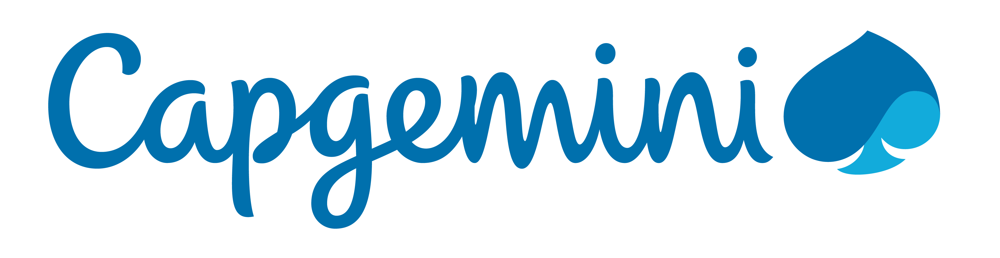
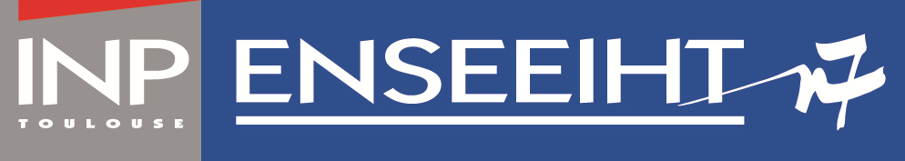
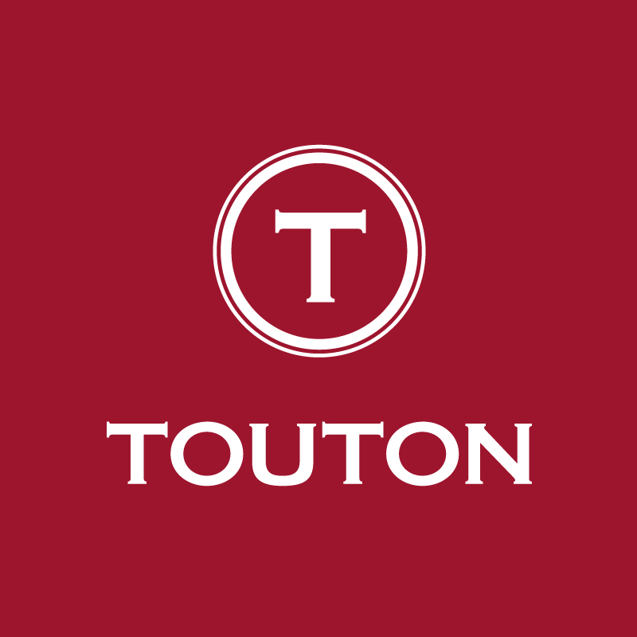

<i>- 11/04/2023 -</i>

# Activities

## 2023

### Avril

#### European Cyber Cup

Participation à l'[EC2](https://european-cybercup.com/) dans l'équipe [Capgemini Aces Of Spades](https://ctftime.org/team/87450) ou nous remportons [la 3ème place sur 25 équipes](https://twitter.com/EuCyberCup/status/1644017921050419203).

#### Cyber Apocalypse

Participation au CTF [Cyber Apocalypse](https://www.hackthebox.com/events/cyber-apocalypse-2023) dans l'équipe [Capgemini Aces Of Spades](https://ctftime.org/team/87450) ou nous remportons [la 63ème place sur 4493 équipes](https://ctftime.org/event/1889).

## 2022

### Consultant en Sécurité informatique - Capgemini

## 2021

### Alternance - Cdiscount

Ingénieur [SRE](https://sre.google/).

### Formation / Diplôme

Master Spécialisé Sécurité Informatique ([tlssec](https://tls-sec.github.io/)) ([RNCP  niveau 7](https://www.letudiant.fr/etudes/qu-est-ce-qu-un-titre-rncp.html)) - ENSEEIHT.

## 2020

### Alternance - Cdiscount

Ingénieur [SRE](https://sre.google/).

### Formation / Diplôme - EPSI

Titre RNCP [niveau 7](https://www.letudiant.fr/etudes/qu-est-ce-qu-un-titre-rncp.html) (bac+5) Architecture Logiciel & Développement - [EPSI](https://epsi.fr/).

## 2019

### Alternance - Cdiscount

Ingénieur [SRE](https://sre.google/).

### Formation / Diplôme - EPSI

Examen du TOEIC - **960/990**

## 2018

### Alternance (3 ans) - Cdiscount

Ingénieur [SRE](https://sre.google/).

### Formation / Diplôme - EPSI

Titre RNCP [niveau 6](https://www.letudiant.fr/etudes/qu-est-ce-qu-un-titre-rncp.html) (bac+3) - Système & Réseau.

## 2017

### Alternance (1 an) - HelloAsso

Ingénieur DevOps : Développement en R&D d'un système de supervision de la conformité asynchrone grâce à l'environnement cloud de Microsoft. (Azure-Functions, Event-Hub, Data-Stream, ...). Support technique N2 sur l'application web de HelloAsso.

### Stage (2 mois) - Touton

Developpeur full stack : Découverte des méthodes agiles et du TDD. Passage d'une solution de logistique interne vers un site web moderne en .Net (C#).

### Formation / Diplôme - EPSI

BTS SIO option SLAM spé Mathématiques.

## 2016

### Stage (3 semaines) - PSI informatique

Développement full stack : Développement en R&D d'une interface web full stack (NodeJs) de gestion des noms de domaines à travers l'API d'ovh.
